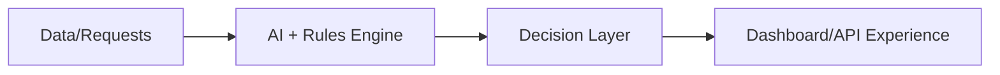

<!-- Header -->
<h1 align="center">Hi, I'm Dheeraj Papani 👋</h1>

<strong>AI + Full-Stack Developer building geospatial platforms and practical NLP systems.</strong>

<!-- GitHub stats / activity -->
## 📊 GitHub Stats & Activity

  
  

  

  

<!-- Featured projects -->
## 🚀 Featured Projects

| Project | One-line Summary | Tech Stack | Highlight | Metric |
|---|---|---|---|---|
| [india-map-portal](https://github.com/dheerajpapani/india-map-portal) | Open-source India-focused web mapping platform with interactive navigation. | React, Vite, MapLibre GL JS, OSRM, GitHub Actions | Experimental turn-by-turn navigation with GPS tracking and rerouting. |  |
| [lodestar-dashboard](https://github.com/dheerajpapani/lodestar-dashboard) | Multi-hazard early warning dashboard for flood and drought awareness. | React, Vite, MapLibre GL, Recharts, AWS (EC2/Lambda) | Geospatial analytics + real-time alerts in a cloud-orchestrated workflow. |  |
| [Text-Guard](https://github.com/dheerajpapani/Text-Guard) | Hybrid moderation workspace for risky user-generated text. | FastAPI, React, MongoDB, Groq, Hugging Face | Combines rule-based detection + LLM scoring with review-queue operations. | 🧪 Recently active |
| [Clara-AI](https://github.com/dheerajpapani/Clara-AI) | NLP automation pipeline converting unstructured transcripts into structured agent configs. | Python, Pydantic, Llama 3.1 (Groq), DeepDiff | Dual-phase extraction pipeline with schema validation and fallback logic. | 🧪 Recently active |
| [DakSamadhan-AI](https://github.com/dheerajpapani/DakSamadhan-AI) | AI-powered grievance redressal MVP with automated classification and prioritization. | FastAPI, React, Supabase, Hugging Face | Dual-portal workflow with urgency-aware complaint routing. | 🧪 Recently active |

<!-- Tech stack / tools -->
## 🧰 Tech Stack & Tools

<!-- Current focus -->
## 🎯 Current Focus
Building reliable AI workflows for civic-tech, geospatial intelligence, and production-ready full-stack apps.

<!-- Fun / community -->
## 🤝 Community
I enjoy turning research-style prototypes into usable products and sharing practical build patterns through open-source projects.

<!-- Footer -->
## 📫 Connect

